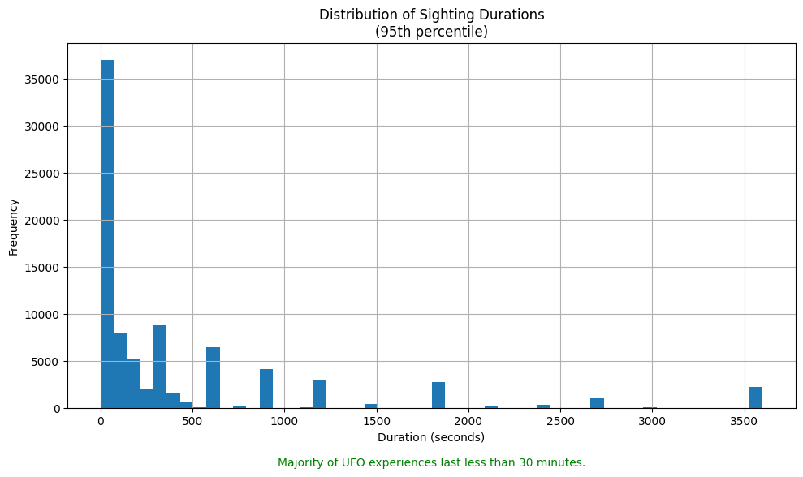
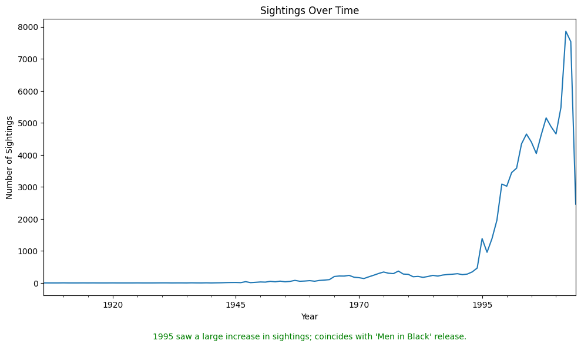
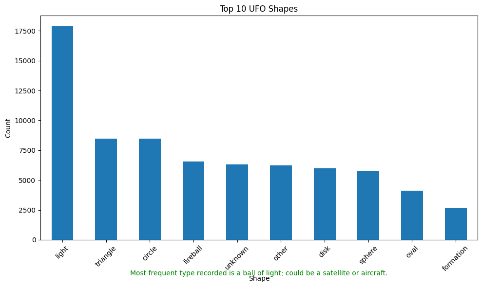

# Lights in the Sky: Decoding UFO Sightings Patterns
## By Clay Bowser, December 7th 2024
## [Data supplied by: National UFO Reporting Center (NUFORC) · Anna Wolak](https://www.kaggle.com/datasets/NUFORC/ufo-sightings/data)
## [Video walkthrough of this Notebook](https://youtu.be/XoPRliDiQy4)
**Description**

This UFO data analysis notebook explores a dataset of UFO sightings through data cleaning, statistical analysis, and visualization. It reveals trends in sighting durations and shapes, ultimately implementing a Random Forest Classifier to predict whether sightings occurred at night. The findings suggest that most UFO sightings happen at night, which may indicate that these phenomena are avoiding detection or that it's easier to misidentify satellites or aircraft under low visibility conditions.

**Features**
- Data cleaning and preprocessing
- Exploratory data analysis with visualizations
- Machine learning model for predicting nighttime sightings
- Insights into UFO shapes, durations, and temporal patterns

**Technologies Used**
- Python
- Pandas, NumPy
- Matplotlib, Seaborn
- Scikit-learn

**How to Use**
- Clone the repository
- Install required dependencies
- Run the Jupyter notebook

**Conclusion**

The model demonstrates a solid accuracy of 75% in predicting whether a UFO sighting occurred at night. It excels at identifying nighttime sightings (True class), achieving a precision of 0.81, recall of 0.91, and an F1-score of 0.85. This indicates that when the model predicts a nighttime sighting, it is correct 81% of the time and successfully identifies 91% of actual nighttime sightings.
However, the model struggles with daytime sightings (False class), showing lower precision (0.33), recall (0.18), and F1-score (0.23). This suggests a tendency to misclassify daytime sightings as nighttime ones, likely due to the significant imbalance in the dataset, with 14,012 nighttime sightings compared to 3,724 daytime sightings.
These results reinforce the observation that UFO sightings are predominantly reported at night, potentially due to increased visibility of aerial phenomena in dark skies or observer bias. While the model performs well overall, there is room for improvement in distinguishing daytime sightings. Future work may focus on addressing this class imbalance and incorporating additional features to enhance predictive accuracy.

